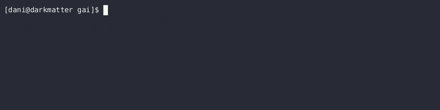

# GAI (Git + AI)

GAI (Git + AI) is a command-line interface (CLI) tool written in Rust that utilizes OpenAI models to generate informative commit messages from a `git diff` by reading from its standard input (stdin). It combines the power of Git with advanced language models to automate the process of creating meaningful and concise commit messages based on the changes made to your Git repository.

## Features

- Uses OpenAI models to analyze the `git diff` and generate descriptive commit messages.
- Seamlessly integrates with Git to streamline the commit process.
- Saves time and effort in writing commit messages manually.

## Getting Started

### Prerequisites

Before using GAI, ensure that you have the following prerequisites installed on your system:

- [Git](https://git-scm.com/downloads)
- [Rust](https://www.rust-lang.org/tools/install)

### Installation

To install GAI, follow these steps:

### From crates.io

```
cargo install gai
```

### From code

1. Clone the GAI repository:

   ```shell
   git clone https://github.com/dpecos/gai.git
   ```

2. Change into the cloned repository directory:

   ```shell
   cd gai
   ```

3. Build and install GAI using Cargo:

   ```shell
   cargo install --path .
   ```

   This will build GAI and install it into your system.

### Configuration

GAI requires an OpenAI API key to run. Before using GAI, make sure to set the `OPENAI_API_KEY` environment variable with your OpenAI API key.

```shell
export OPENAI_API_KEY=<your-openai-api-key>
```

### Usage

To use GAI, follow these steps:

1. Navigate to your Git repository's root directory.
2. Run the `git diff` command to generate the diff of your changes.
3. Pipe the `git diff` output to GAI:

   ```shell
   git diff | gai
   ```

   GAI will process the input from `git diff` using OpenAI models and generate a commit message based on the changes.

   **Note:** GAI reads from the standard input (stdin), so make sure to pipe the `git diff` output correctly.

4. Review the generated commit message and make any necessary adjustments.
5. Commit your changes using the generated commit message:

   ```shell
   git commit -m "$(git diff | gai)"
   ```

   This will create a new commit with the generated commit message.

An alternative is to define a shell alias that brings everything together:

```
alias gaic='git diff --cached | gai | git commit -F -'
```

But if this feels too much of rush, and you'd like to confirm the commit message manually, you can use [`ays`](https://github.com/dpecos/ays) like this:

```
alias gaic='git diff --cached | gai | ays --preview "Use this message for the commit?" | git commit -F -'
```

And this is how your workflow would look like:



## Contributing

Contributions to GAI are welcome! If you find any issues or have suggestions for improvements, please feel free to open an issue or submit a pull request to the [GitHub repository](https://github.com/dpecos/gai).

Before contributing, please review the [Contribution Guidelines](CONTRIBUTING.md) for important information.

## License

GAI is licensed under the [MIT License](LICENSE). Feel free to use, modify, and distribute this project as per the license terms.

## Acknowledgments

GAI was created by Daniel Pecos Martinez. Special thanks to all the contributors who have helped make this project better.

## Contact

If you have any questions, suggestions, or feedback, you can reach out to the project maintainer at [me@danielpecos.com](mailto:me@danielpecos.com).

Happy coding!
